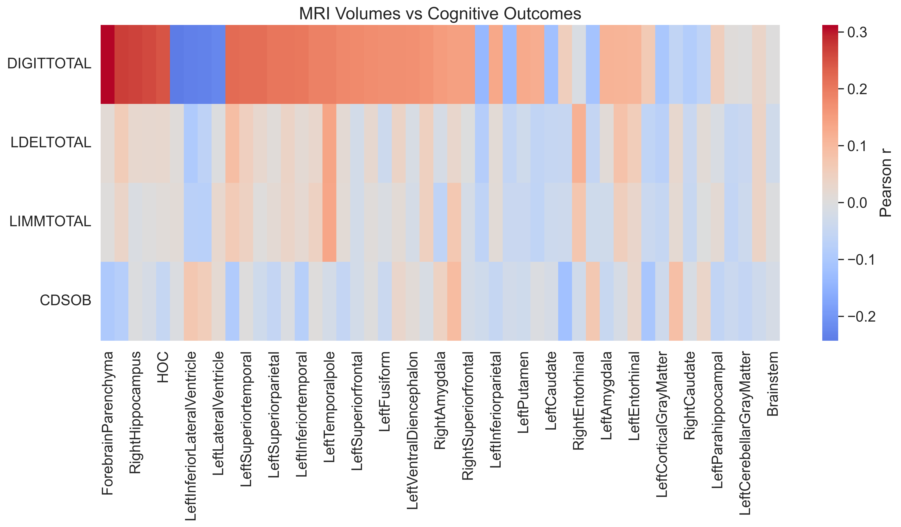

# Brain Morphometry and Human Memory: MRI-Based Analysis of Cognitive Outcomes in the A4 Study data

**Exploring the relationship between brain morphology and memory performance

---
**Author**: Mostafa Mashhadizadeh  
**Affiliation:** Shiraz University of Technology  
**Contact:** mashhadizademostafa@gmail.com

## Highlights

### Heatmaps

  
**Figure 1** — Correlation heatmap between MRI volumetric regions and key cognitive outcomes.

  
**Figure 2** — Correlation heatmap between Tau PET SUVR measurements and cognitive outcomes.

---

## Data Access

The **A4 Study** dataset is *not publicly available*.  
To access the MRI, PET, and cognitive data used in this analysis, you must apply through the official data request portal:

[Request A4 Study Data Access](https://www.a4studydata.org)

**Dataset overview (for approved applicants):**
- Volumetric MRI (3D T1-weighted NeuroQuant segmentation)
- Florbetapir Amyloid PET SUVR
- Flortaucipir Tau PET SUVR
- Cognitive outcomes (DIGITTOTAL, PACC, MMSE)
- Demographics (Age, Sex, Education, APOE genotype)

**Example schema** *(values are illustrative only)*:

| BID    | Age | Sex | RightHippocampus | HOC  | LeftSuperiorparietal | DIGITTOTAL |
|--------|-----|-----|------------------|------|----------------------|------------|
| 123456 | 72  | M   | 3.45             | 0.68 | 8.91                 | 47         |

---

## Workflow

1. Load MRI, PET, cognitive, and demographic datasets (CSV format)
2. Normalize volumetric MRI metrics by intracranial volume (ICV)
3. Perform correlation analysis to find MRI regions most related to DIGITTOTAL
4. Generate visualizations:
   - Heatmaps (MRI vs outcomes, Tau vs outcomes)
   - Scatter plots (HOC, RightHippocampus, LeftSuperiorparietal)
   - PCA and UMAP embeddings
   - ICV effect plots
   - Bar plots of top correlations
5. Save all figures in `outputs/`

---

## Selected Figures

### Scatter Plots


### Bar Plots — Top 10 MRI Correlations


### PCA Embedding


### UMAP Embedding


### ICV Effect Example


### Distribution Summary


---

## Running the Analysis

**Requirements:**
```bash
pip install -r requirements.txt
```

**Run:**
```bash
python src/main.py
```

All generated figures will be placed in:
```
outputs/
```

---

## References

- Sperling, R.A., Donohue, M.C., Raman, R., et al. (2020). Association of factors with elevated amyloid burden in clinically normal older individuals. *JAMA Neurology*, 77(6), 735–745.
- [A4 Study official site](https://a4study.org/)
- [A4 Data Access Portal](https://www.a4studydata.org)
- [NeuroQuant Segmentation](https://www.cortechslabs.com/neuroquant/)
